# Hospital Management System

## Table of Contents

- [Introduction](#introduction)
- [Technologies and Tools](#technologies-and-tools)
- [Program Demonstration](#program-demonstration)

## Introduction

This hospital management application is developed in Java, using JavaFX for the graphical interface. The application allows for viewing and managing data on doctors, patients, appointments, expenses, 
and medical records. The data is stored in a database(MySQL), and the application uses JDBC for connectivity. It enables adding new patients, scheduling appointments, tracking expenses, and maintaining medical records.

## Technologies and Tools

This project utilizes the following technologies and tools:

- **JavaFX**: Used for creating the graphical user interface (GUI).
- **JDBC (Java Database Connectivity)**: A technology for connecting the Java application with a relational database, allowing data manipulation and execution of SQL queries.
- **MySQL**: The relational database used for storing information about patients, doctors, appointments, expenses and medical records.
- **XAMPP**: A software package used for locally hosting the MySQL database and managing it.

## Program Demonstration

  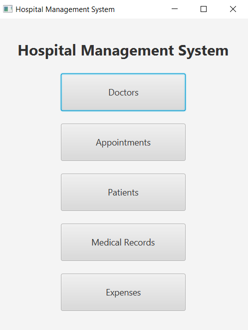
  
Start window

  

  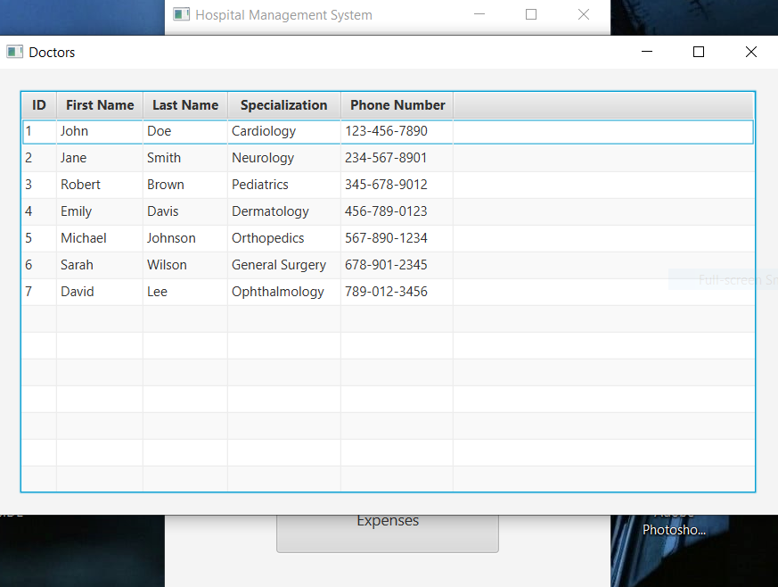
  
List of doctors

  

  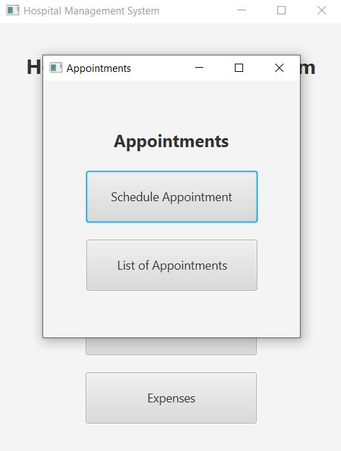
  
Appointments window

  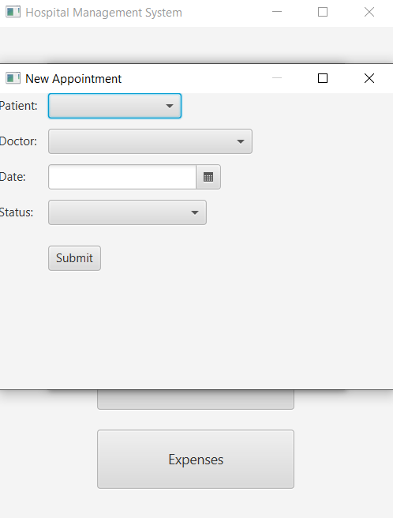
  
Form for entering a new appointment

  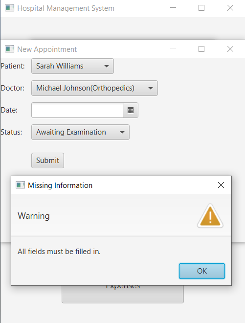
  
Error if not all fields are filled

  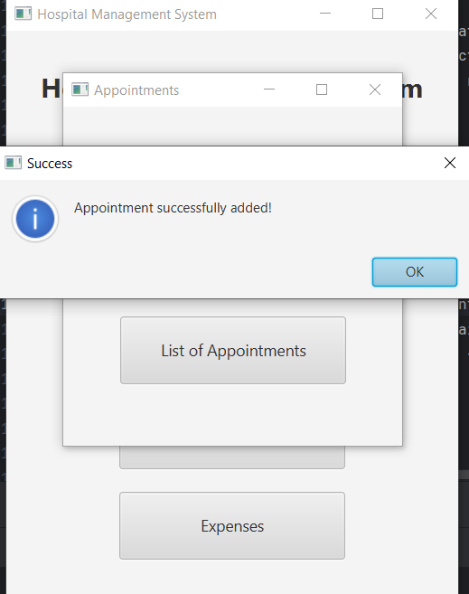
  
Added successfully appointment

  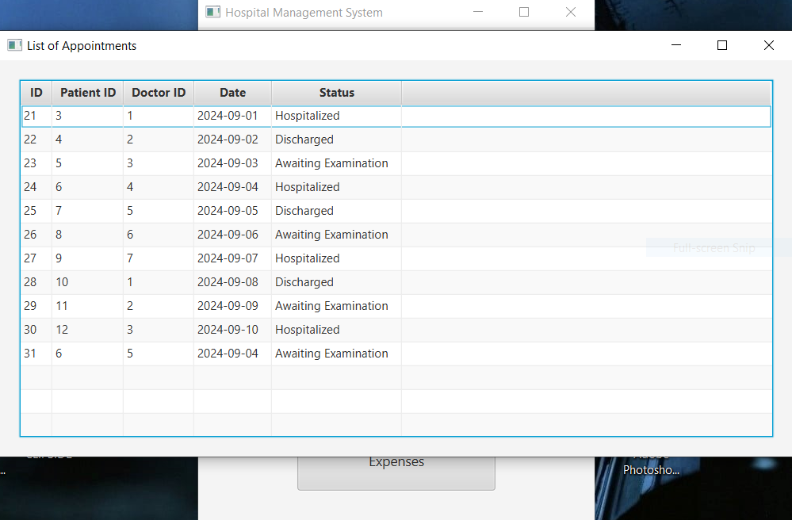
  
List of appointments

  

  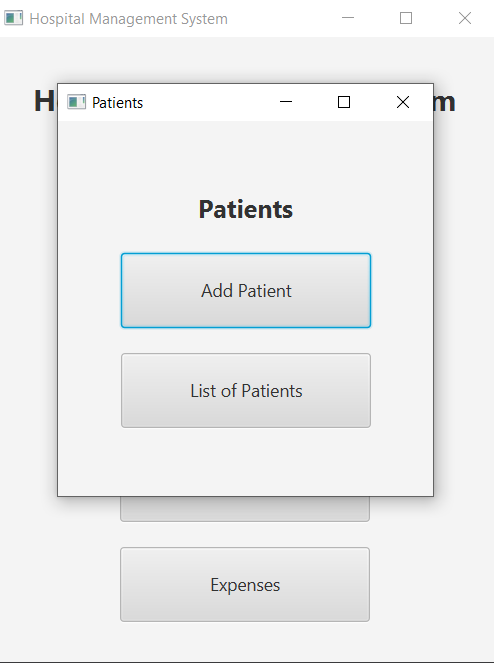
  
Patients window

  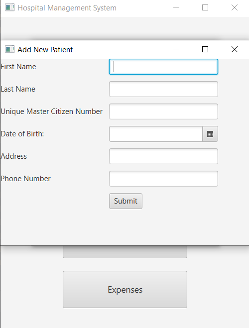
  
Form for entering a new patient

  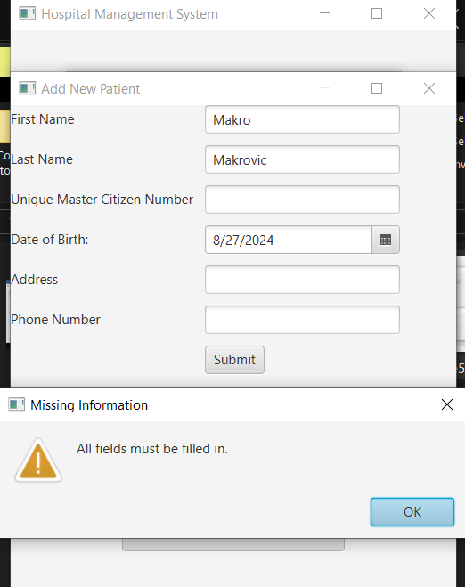
  
Error if not all fields are filled

  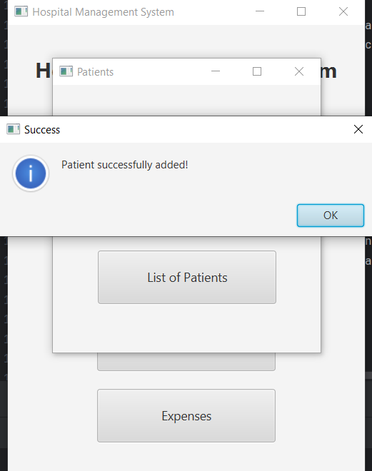
  
Added successfully patient

  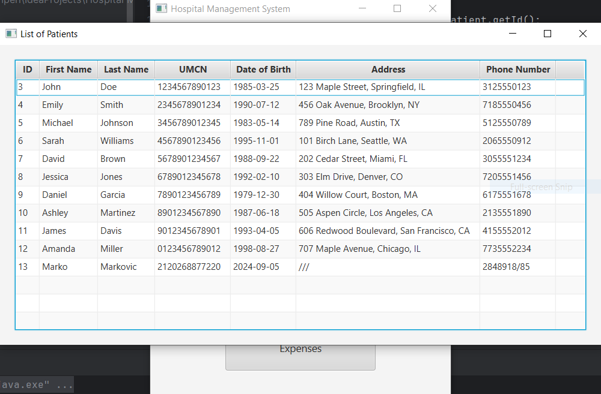
  
List of patients

  

  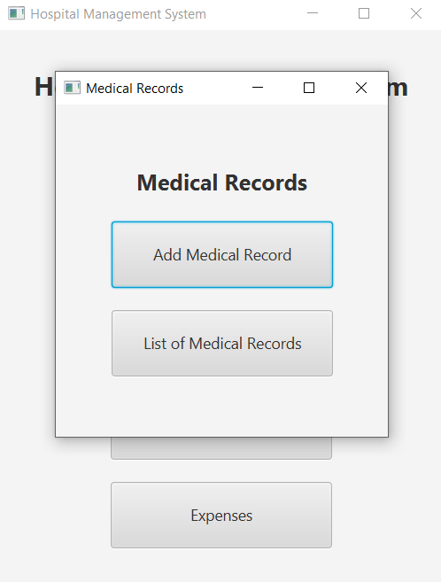
  
Medical Records window

  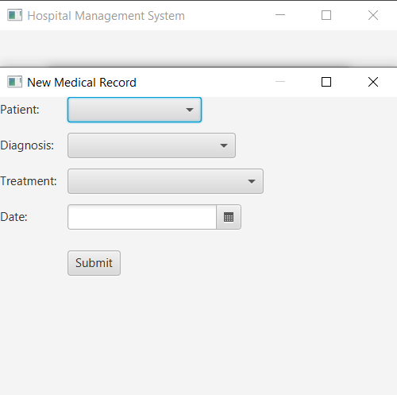
  
Form for entering a new medical record

  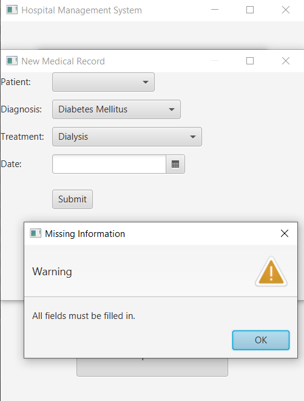
  
Error if not all fields are filled

  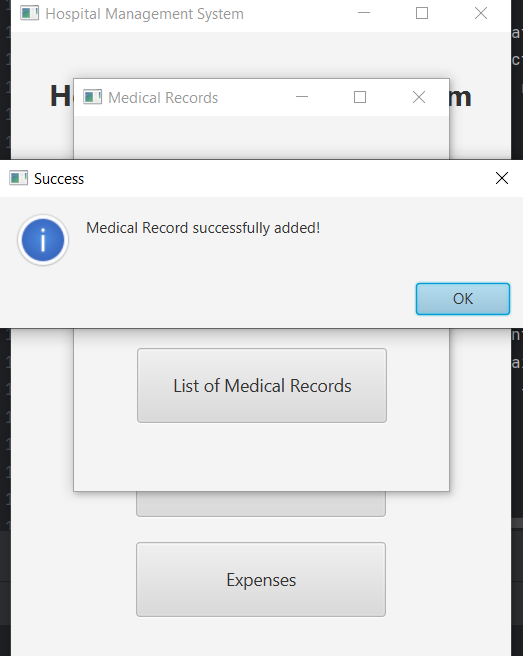
  
Added successfully medical record

  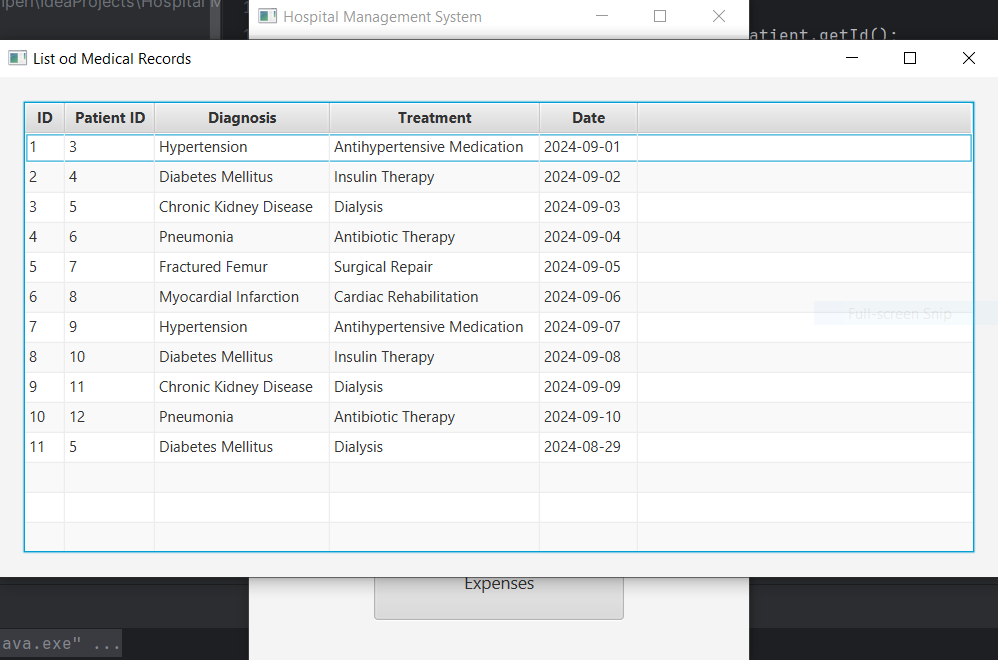
  
List of medical records

  

  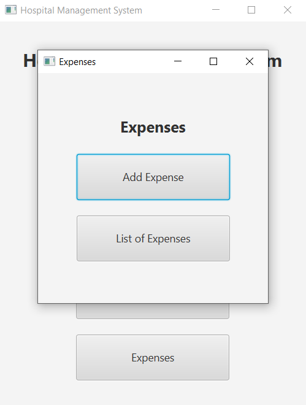
  
Expenses window

  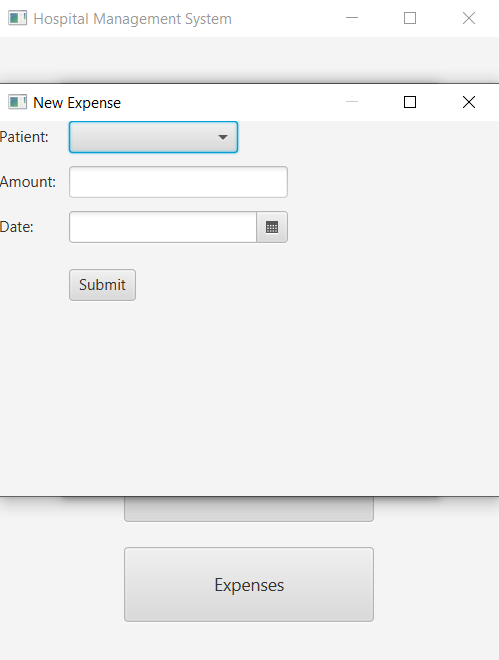
  
Form for entering a new expense

  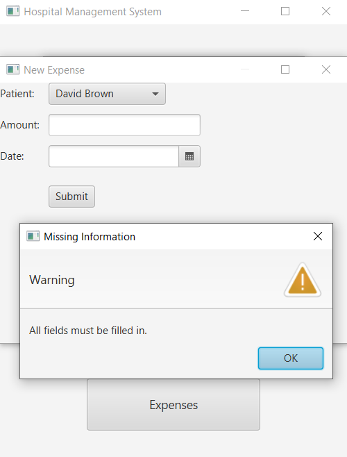
  
Error if not all fields are filled

  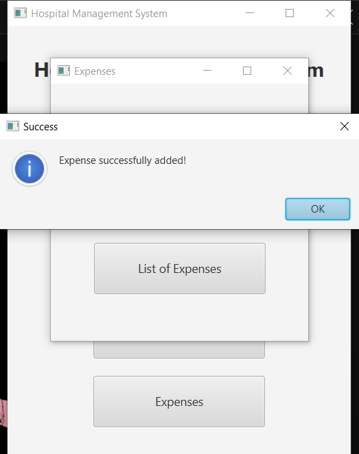
  
Added successfully expense

  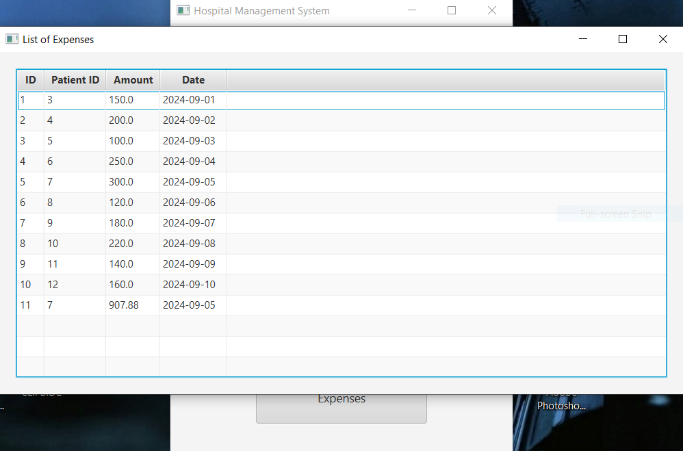
  
List of expenses

